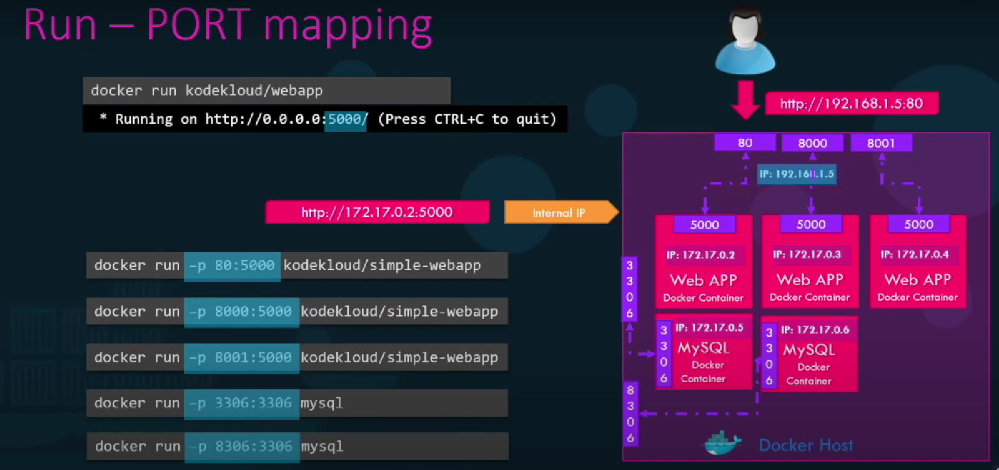
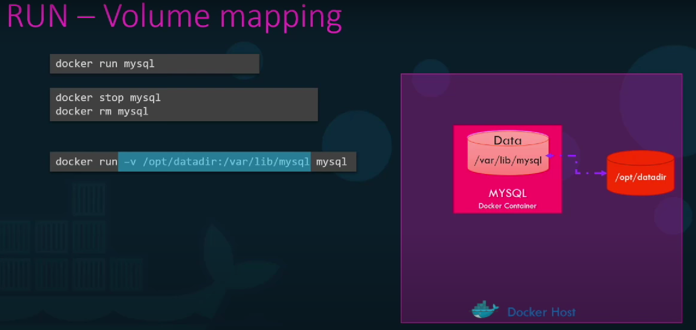
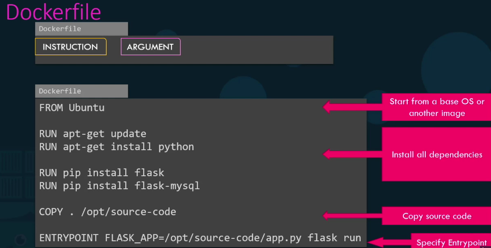
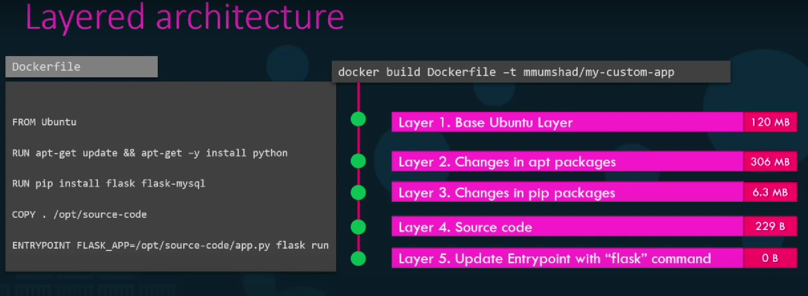
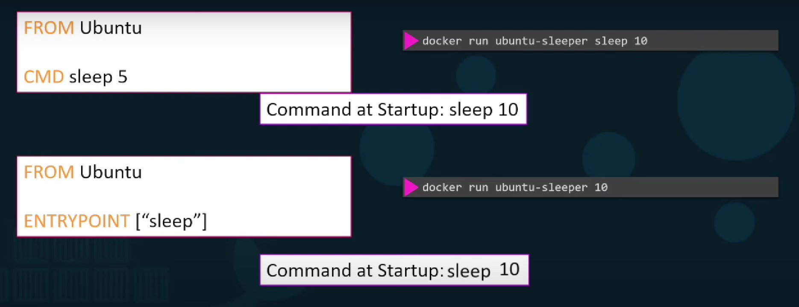
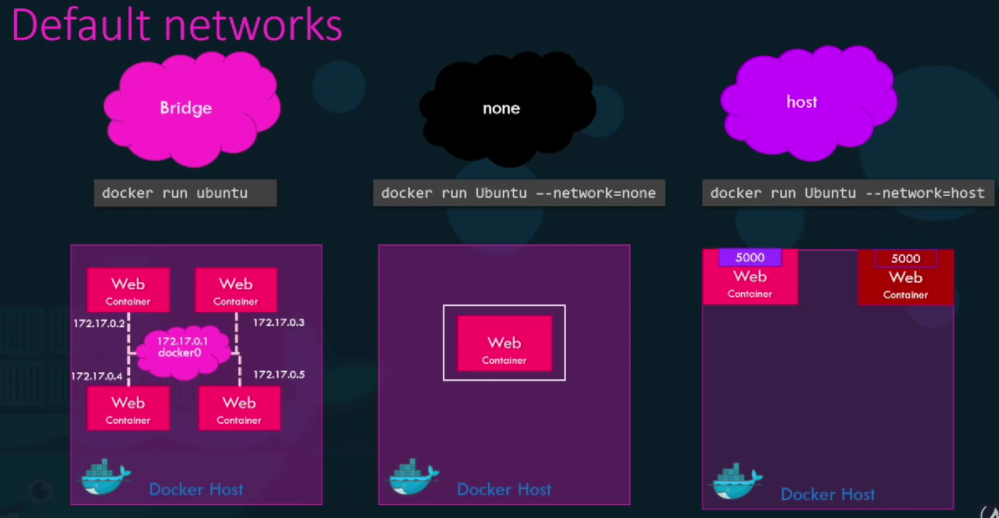

# 🐳 Docker 

Resumé de mes connaissances sur Docker

***

### 🆚 Conteneur VS VM
- **VM** 
	- Virtualisation lourde  
	- Prends du temps à demarrer
	- Les ressources attribuée lui sont totalement réservées
	- Totalement isolée du sys hote
	- Différents OS possible
- **Conteneur** 
	- Virtualisation légère
	- Ne virtualise pas les ressources, crée une isolation de processus, partage les ressources avec l'hote
	- Ne reserve que les ressources nécessaires
	- Démarre rapidement  
Les conteneurs réduisent les couts, augmentent la densité de l'infrastructure, tout en améliorant le cycle de déploiement  
⚠️L'un de remplace pas l'autre

	
	 
	Conteneur VS VM

### 🤔 Pourquoi Docker
⚠️Docker ne fait tourner qu'un processus par conteneur, donc si on a une stack **Apache, MySQL, PHP** on aura 3 conteneur (1 pour chaque service)  
-  Il est plus simple d'utiliser Docker en local quand on travaille avec de nombreuses versions différentes des logiciels, et ainsi ne pas avoir de problèmes de compatibilité entre elles.
- Docker apporte aussi les notions de **stateless** et d'**immutabilité** (cf : <a href="https://openclassrooms.com/fr/courses/2035766-optimisez-votre-deploiement-en-creant-des-conteneurs-avec-docker/6211349-decouvrez-ce-quest-docker#/id/r-6211325" target = "_blank">Stateless et immutabilité</a>)

### 👨‍💻 CMD
**🚧 On peut specifier un idContainer avec seulement ses premiers caractères (suffisament pour le differencier des autres containers)**

- **docker pull *nomImage*[:numVersion]**  
Va telecharger l'image à partir de <a href="https://hub.docker.com" target="_blank">docker hub</a>
	- **[:numVersion]** : Specifier la version que l'on veut utiliser (Tag)

- **docker run [-d] [-it] [--name *nomContainer*] [-p portH:portD] [-v cheminDataH:cheminDataD] [-e *variableEnv*=*val*] [--entrypoint *cmd*] [--network=*none/host*] [--network *nomReseau*] *nomImage***  
Lance un container de l'image *nomImage* si elle existe, si elle n'existe pas la commande `docker pull` sera executée  
	- **[-d]** : Lance le container en *detached mode* en background
	- **[it]** : Pour se mapper au terminal et se lancer en *mode interactif* (Avoir un input effectif dans notre container en gros)
	- **[--name *nomContainer*]** : Nommer le container avec *nomContainer*
	- **[-p portH:portD]** : Mapper **portH** (port de la machine host) a **portD** (port du container)
	- **[-v cheminDataH:cheminDataD]** : Mapper les données se trouvant dans un container a un dossier de la machine hote, grace à ça **si on supprime le container, les données persistent dans le dossier de la machine hote**  
	- **[-e *variableEnv*=*val*]** : Lance le container en mettant **variableEnv** à **val**
	- **[--entrypoint *cmd*]** : Modifie le entrypoint pour cette run (cf [⛔ Entry point](#⛔-entry-point))
	- **[--network=*none/host*]** : Modifie le type de réseau de l'image (cf [🚆 Réseau](#🚆-réseau))
	- **[--network *nomReseau*]** : Assigne le réseau *nomReseau* au container
	

		
		 
		Exemple de multiple mappage
	

		

		
		 
		Exemple de mappage de données
	

		

		

		
		 
		Exemple d'utilisation de var d'environnement
	

- **docker attached *nomContainer/idContainer***  
Quitte le mode background

- **docker ps [-a]**  
Affiche des infos sur les containers en cours d'exec
	- **[-a]** : Affiche des infos sur tous les containers (en cours d'exec ou non)

- **docker stop *nomContainer/idContainer***  
Stop le container (désigné par *nomContainer* ou *idContainer*)

- **docker rm *nomContainer/idContainer***  
Supprime le container (désigné par *nomContainer* ou *idContainer*)

- **docker *images***  
Affiche des infos sur les images présentes

- **docker rmi *nomImage***  
Supprime l'image *nomImage*  
	**⚠️ Il faut d'abord stop et supprimer tous les containers de l'image !**

- **docker exec *nomContainer* *cmd***  
Run la cmd dans le container *nomContainer*

- **docker version**  
Affiche la version de docker 

- **docker inspect *nomContainer***  
Affiche les infos détaillés de *nomContainer* en format **json** (on peut y trouver les variables d'environnements, les parametres réseau)

- **docker logs *nomContainer***  
Affiche les logs de *nomContainer*

- **docker build -t *nomImagePerso* *repertoireSource***
Creer une image *nomImagePerso* à partir du code *codeImage*  
	- *repertoireSource* Contient les fichiers necessaires pour le build (ex : dockerfile, app.py, ...ect)  
💡 Propal de nomImagePerso : nomUser/nomCode

- **docker history *nomImage***  
Affiche l'historique d'une image

- **docker push *nomImagePerso***  
Push l'image *nomImagePerso* dans <a href="https://hub.docker.com" target="_blank">docker hub</a>

- **docker network create [--driver *typeReseau*] [--subnet *@Réseau*] [--gateway *@gateway*] *nomRéseau***  
Creer un réseau nouveau interne

- **docker network ls**  
Affiche tous les réseaux

- **docker network inspect *nomReseau/idReseau***  
Affiche les info du réseau spécifié

***

### 📸 Image

#### 💾 Création d'image

	

	

	
	 
	Exemple de code de création d'image

 

	

	

	
	 
	Etapes de création d'une image

Si une des étapes de création échoue (ou si on change le code pendant le dev par ex), lors de la deuxieme tentative les étapes validées précedement n'auront pas besoin d'etre refaites (tout reste en cache)

#### ⛔ Entry point
On peut creer un **entrypoint** afin de pouvoir passer facilement des arguments lors de la run d'un container 

	

	

	
	 
	CMD tout seul (degeu) VS Entrypoint (chad yeslife)

On peut aussi combier **entrypoint** et **cmd** pour avoir une valeur d'argument par defaut  

	FROM UBUNTU
	:::
	ENTRYPOINT ["sleep"]
	CMD ["5"]
Si on ne specifie pas une valeur lors de la commande `docker run` alors le container va executer un sleep de 5

#### Exemple Dockerfile
	``
	FROM debian:9

	RUN apt-get update -yq \ 
	&& apt-get install curl gnupg -yq \
	&& curl -sL https://deb.nodesource.com/setup_10.x | bash \
	&& apt-get install nodejs -yq \
	&& apt-get clean -y

	ADD . /app/
	WORKDIR /app 
	RUN npm install

	EXPOSE 2368
	VOLUME /app/logs

	CMD npm run start
	``
**Récap :**  
- `FROM` : utilisable une fois seulement, specifie l'os de base de l'image
- `RUN` : essayer de les limiter est souhaitable afin de limiter le nbr de layer crées, exec la cmd specifiée
- `ADD` : copie ou dl des fichiers dans l'image   
- `WORDKIR` :  modifie le rep courant, les cmd qui suiveront seront exécutées depuis le repertoire défini
- `EXPOSE ` :  indique le port sur laquelle l'appli écoute  
- `VOLUME` : indique le rep qui sera partagé avec l'hote
- `CMD` : permet au conteneur de savoir quelle cmd executer lors de son démarrage  
***

### 🚆 Réseau
Il existe 3 modes de réseau 
1. **Bridge**  
Réseau par **défaut** d'un container, un réseau **privé**, tous les containers sont reliés à ce réseau, les containers peuvent communiquer entre eux en utilisants leurs **@IP internes**, pour acceder a un container de l'exterieur on **map** le port du container a un port de la machine hote  
⚠️ Les containers peuvent communiquer entre eux en se désignants par leur noms (cimer le dns integré)
1. **None**  
Réseau **totalement isolé** de tout
1. **Host**  
Associe le container au réseau de l'hote, supprime toute isolation entre le container et l'hote, le container est alors accessible à partir du **meme numero de port de l'hote** que celui specifié dans docker  
⚠️ On ne peut donc **plus** lancer plusieurs container sur le meme port comme en mode Bridge

	

	

	
	 
	Les différents modes réseau

***

### 🖊 Annexes
- <a href="https://www.docker.com/" target="_blank">Site officiel</a>   
- <a href="https://hub.docker.com" target="_blank">Docker hub</a>
- <a href="https://dockerlabs.collabnix.com/docker/cheatsheet/" target="_blank">Cheat sheet tip top</a>