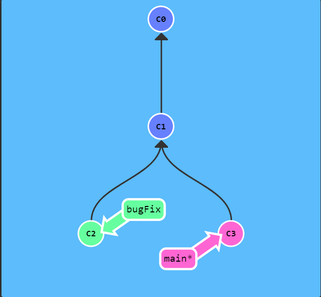
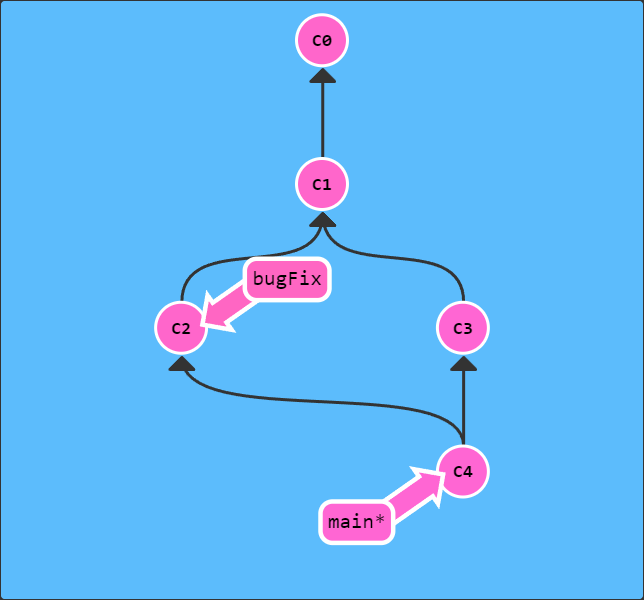
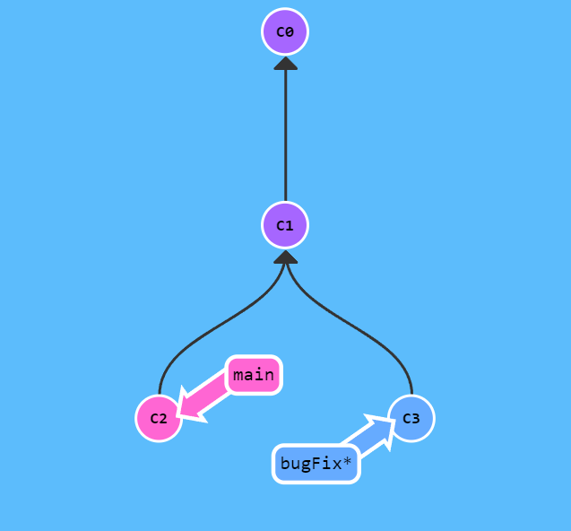
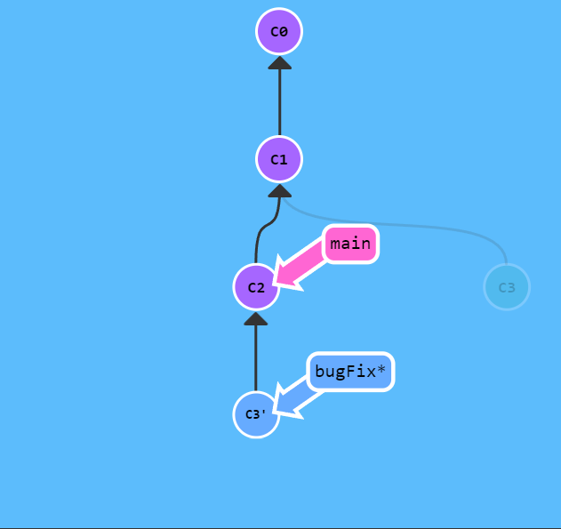

# 🌱 Git 

Resumé de mes connaissances sur Git

***
### 🗒 Explanations
**Commit** => Snapshot du repertoire de travail, à chaque commit git n'enregistre que les changements (deltas) survenu apres le dernier commit.  
**Branche** => Pointeur vers un commit.  
**Merge** => Fusion de deux branche.

### 👨‍💻 CMD
- **git commit -m *messageCommit***  
Commit les changement survenu apres le dernier commit.
	- *messageCommit* : Message explicatif du commit.

- **git branch *nomBranche***  
Créé une branche *nomBranche*.

- **git checkout *nomBranche***    
Positionne sur *nomBranche*.

- **git switch *nomBranche***  
Positionne sur *nomBranche* (askip nouvelle version).

- **git checkout -b [yourbranchname]**  
Créé la branche *nomBranche* et nous positionne dessus.

- **git merge *nomBranche***  
Fusion *nomBranche* avec *main*.
	

		

		
		 
		Arbo <strong>avant</strong> merge
	

		

		

		
		 
		Arbo <strong>après</strong> merge
	

- **git rebase *nomBranche***  
Fusionne aussi les branches mais cette fois en gardant une ramification.
	

		

		
		 
		Arbo <strong>avant</strong> rebase
	

		

		

		
		 
		Arbo <strong>après</strong> rebase
	

### 🖊 Annexes
- <a href="https://learngitbranching.js.org/" target="_blank">Lab tiptop</a>   